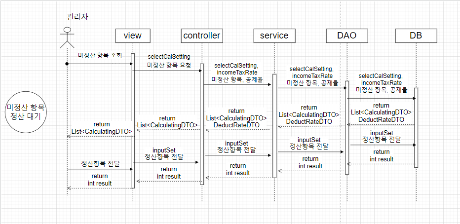

# 관리자의 정산 기능

## 1. 단위 업무 흐름도

관리자로 로그인 해, '청소해결사 정산처리'를 선택하면 DB에 저장돼 있던 결제 정보와 의뢰 정보를 불러와 view에서 보여주도록 만들려고 합니다.

이후 관리자가 선택, 처리한 정산 내역을 '정산 정보' 관련 DB에 저장하는 것으로 프로세스는 종료되게 합니다.

## 2. 데이터베이스 모델링

.png>)

해당 기능을 구현하기 위해 필요한 엔터티는 크게 8개입니다.

* 회원 : 사용자 혹은 해결사 정보 조회
* 의뢰 정보 : 의뢰 상태, 일시 등 의뢰 관련 정보 일체
* 의뢰 간접비 : 카드수수료, 운영 마진 등 의뢰 중개를 통해 발생한 간접비 일체
* 의뢰 상태 관리 : 한 의뢰 건에 대해서 의뢰 상태의 변경 이력 관리
* 정산 기간별 의뢰 : 정산내역 엔터티와 의뢰정보 엔터티의 다대다 관계를 해소하기 위한 엔터티
* 정산 내역 : 정산 건당 도출되는 금액 (세전 금액, 소득세, 주민세, 이체금액)&#x20;
* 정산 공제율 : 항목별(소득세, 주민세, 카드수수료, 운영 마진 등) 적용할 요율
* 정산 공제율 변경 이력 : 정산 공제율의 변경 이력

## 3. 화면 정의서

.png>)

페이지에 진입하면 나오는 정산 항목들과, 정산 기능을 실행하기 위한 버튼 등을 설명한 정의서입니다.

화면 정의서를 만들면서 로직을 한번 더 생각하게 됐고 UX를 한번 더 고려해보게 됐습니다.

## 4. 시퀀스 다이어그램

최초에 관리자가 nav-bar를 통해 페이지를 호출하면 DB에서 미정산 항목과 공제율을 산출해 view에서 보여줍니다.

보여진 내역들 중 '정산 항목'을 선택해 '정산하기' 버튼을 클릭하면 이에 대한 내역이 DB에 저장되고, 그 결과를 view에서 alert 창으로 보여줍니다.

## 5. 구현 화면 및 코드

### 1) 구현 화면

 (1).png>)

### 2) Controller & Service

.png>)

1\) Controller에서는 정산하고자 하는 기간에 맞는, 미정산 리스트 호출합니다.

2\) DB에서 조건에 맞는 데이터를 select 한 뒤, service에서 세율을 계산 후 다시 controller로 return 합니다.

### 3) View 코드

 (1).png>)

1\) view에서 관리자는 정산할 항목을 클릭하고, checked 된 항목을 다시 전송해 저장합니다.

### 4) 다시 Service

* **Service**

 (1) (1).png>)

1\) view에서 전달 받은 값을 기반으로 service에서는 hashMap에 담에 DB에 insert하는 것으로 프로세스는 종료됩니다.
