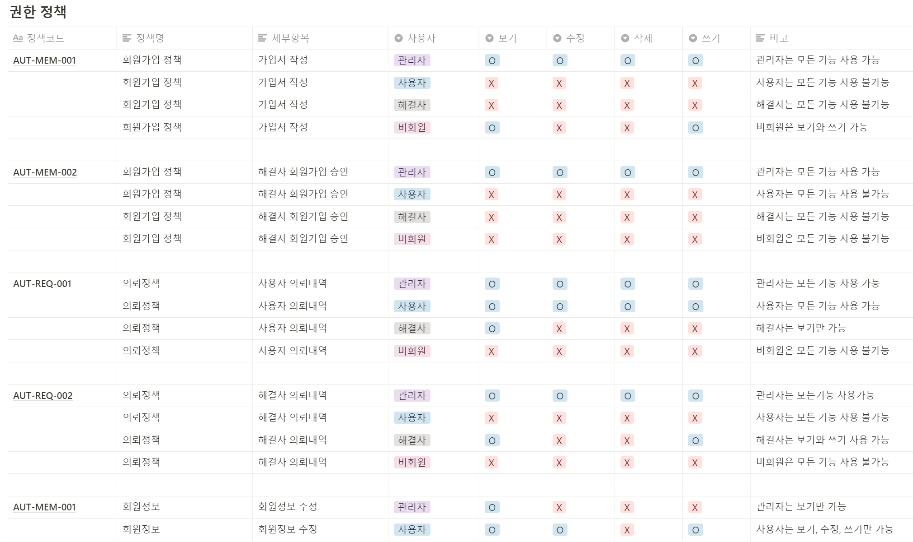

# step2 설계

## 1. 데이터베이스 설계

#### 먼저, 논리 데이터 모델(ERD)를 작성했습니다.

 (1).png>)

####

* 사용 tool : DA#
* 표기법 : Barker 표기법

#### 엔터티 설명(왼쪽 상단 '의뢰 정보'부터)

1\) '의뢰 정보'는 '회원'인 사용자와 해결사 모두의 정보를 받아 오며, 각각의 회원은 여러 '의뢰 정보'를 가질 수 있기 때문에 회원 : 의뢰 정보 = 1 : 다 관계로 만들었습니다.

2\) 의뢰 상태가 '완료'일 때에 한 해, 의뢰 첨부파일을 등록하며, 여러 사진을 등록할 수 있기 때문에 '의뢰 정보' : '의뢰 첨부파일' = 1 : 다 관계로 만들었습니다.

3\) '의뢰 정보'는 여러 종류의 '의뢰 간접비'를 가질 수 있으므로(ex. 부가세, 중개비 등) 역시 1 : 다 관계로 만들었습니다.

4\) 하나의 의뢰는 상태가 지속적으로 바뀌므로 '의뢰 정보'와 '의뢰 상태 관리'의 관계는 1:다 관계입니다.

이후 테이블 정의서를 만들고 oracle에 script를 읽혀 테이블을 생성했습니다.

.png>)

## 2. 화면 설계

먼저 운영 정책을 세우고 화면별 권한 정책을 작성했습니다.

.png>)

이후 IA(Information Architecture)와 메뉴 구조도, 화면 정의서를 작성하며 프로젝트의 구조를 확정 지었습니다.

.png>)

메뉴 구조도는 whimsical을 활용해 작성했습니다.

.png>)

미리 작성했던 prototype을 기반으로 화면 정의서를 작성할 수 있습니다.

.png>)

여기까지 완성한 뒤, 각자의 담당 파트에 맞게 프로그램 목록을 짰습니다.

프로그램 목록에서 작성할 부분은

1\) package명

2\) controller class명

3\) method 명

4\) URL

5\) 구현방식, 권한, html 파일명 등

이었습니다.&#x20;

.png>)

이를 작성하면 초기 세팅 담당자가 이에 맞게 세팅을 진행했고, 이후 구현에 들어갔습니다.&#x20;
