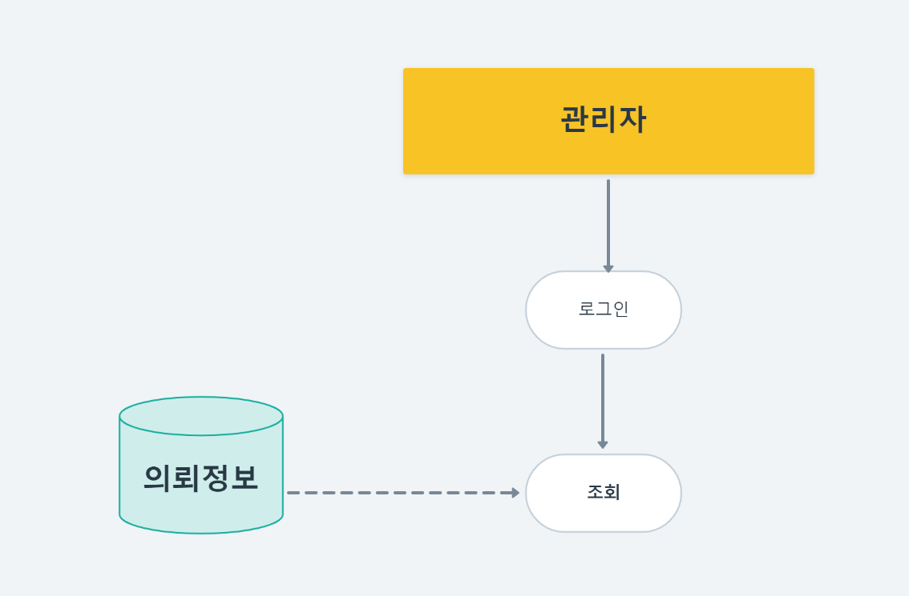
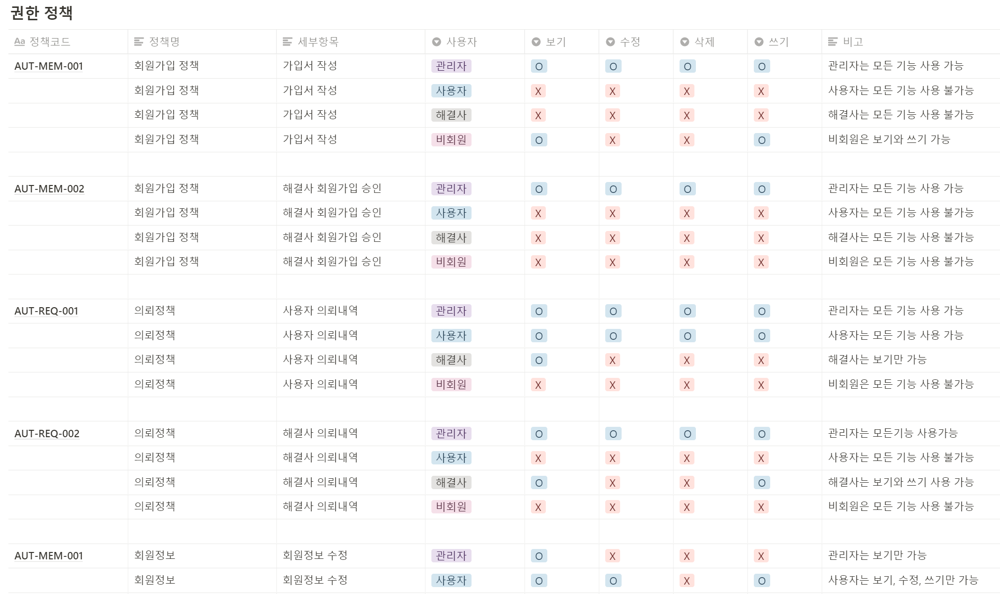

# 기획부터 구현까지

'맡겨줘홈즈' 프로젝트의 모든 산출물 - notion 주소 : [https://url.kr/1xb3f9](https://url.kr/1xb3f9)

## 1. 업무 분석, 요건 정의, 기획

담당 파트를 어떤 흐름으로 이어갈 것이며, DB는 어떤 테이블이 필요할 것인지 예측하기 위해

전체 업무 흐름도와 단위 업무 흐름도를 작성했습니다.

.png>)

작성한 걸 바탕으로 논리 데이터 모델(ERD)를 작성했습니다.

.png>)

#### 엔터티 설명(왼쪽 상단 '의뢰정보'부터)

1\) '의뢰 정보'는 '회원'인 사용자와 해결사 모두의 정보를 받아 오며, 각각의 회원은 여러 '의뢰 정보'를 가질 수 있기 때문에 회원 : 의뢰 정보 = 1 : 다 관계로 만들었습니다.

2\) 의뢰 상태가 '완료'일 때에 한 해, 의뢰 첨부파일을 등록하며, 여러 사진을 등록할 수 있기 때문에 '의뢰 정보' : '의뢰 첨부파일' = 1 : 다 관계로 만들었습니다.

3\) '의뢰 정보'는 여러 종류의 '의뢰 간접비'를 가질 수 있으므로(ex. 부가세, 중개비 등) 역시 1 : 다 관계로 만들었습니다.

4\) 하나의 의뢰는 상태가 지속적으로 바뀌므로 '의뢰 정보'와 '의뢰 상태 관리'의 관계는 1:다 관계입니다.

## &#x20;2. 구현

아래는 복잡한 정산 시스템을 잘 이해한 뒤 구현하기 위해, 다양한 방식으로 고민했던 흔적입니다.

.png>)

&#x20;건별 미정산 리스트를 불러오고, service 부분에서 청소 해결사(=청소 용역인력)별로 정산금을 합계 처리하는 과정을 손으로 적어 이해했습니다.

&#x20;미리 적어봤기 때문에 코드 작업 중에도 현재 어느 단계에 있는지, 어떤 걸 해결해야 하는 지를 좀 더 빠르게 포착할 수 있었습니다.

.png>)

&#x20;미정산 리스트를 조회하기 위해 필요한 조건들을 작성했습니다.&#x20;

select 문을 작성하면서 join할 table을 명확히 하기 위해, 어떤 정보가 필요해서 join하는 지 적음으로써 table을 헷갈리지 않고 작성할 수 있었습니다.&#x20;

.png>)

hashMap을 활용해, 청소 해결사의 회원번호 별 정산금을 합산하는 프로세스입니다.

당시 이 프로세스를 해결하는 것이 가장 어려웠었습니다.&#x20;

그 원인은&#x20;

1\) hashmap을 활용한다는 아이디어 자체를 떠올리기 어려웠고

2\) 회원번호를 key로 설정하고 list<>를 value로 재분류 하는 것이 익숙치 않았으며

3\) view에서 ajax로 넘기는 것도 생소했었기 때문입니다.

지금이라면 금방 해결할 수 있는 부분이지만, 당시에는 굉장히 낯설고 체화 되지 않은 부분이라 시간도 많이 걸리고 방향을 못 잡았었습니다.

## 2-2. 구현 코드

.png>)

* **Controller & Service**

Controller에서는 정산하고자 하는 기간에 맞는, 미정산 리스트 호출합니다.

DB에서 조건에 맞는 데이터를 select 한 뒤, service에서 세율을 계산 후 다시 controller로 return 합니다.

view에서 관리자는 정산할 항목을 클릭하고, checked 된 항목을 다시 전송해 저장합니다.

* **View**

.png>)

* **Service**

.png>)

view에서 전달 받은 값을 기반으로 service에서는 hashMap에 담에 DB에 insert하는 것으로 프로세스는 종료됩니다.

## 3. 프로젝트 소감

&#x20;끈질기게 물고 늘어지는 법을 익힌 프로젝트였습니다. 복잡하지만 정확성을 요하는 정산 프로세스의 모든 과정이 도전이었습니다.&#x20;

&#x20;직면한 문제를 이해하고, 프로젝트에 적용하기 위해 도식화, 줄글로 표현하기, 진행 과정을 잘게 쪼개기라는 세 가지 방식을 적용해봤습니다.

&#x20;첫째로 도식화를 통해 해결하고자 하는 문제를 그림으로 다시 이해했고, 그 흐름 속에서 무엇을 어떻게 처리해야 하는지 글로 적어봤습니다. 마지막으로 처리 과정을 잘게 쪼개 하나씩 차례로 도전해봤습니다.

&#x20; 해결할 문제에 대한 이해가 높아지고, 목적이 뚜렷해지며 부담이 줄자, 조금만 더 해보자는 자신감이 생겼습니다. &#x20;

&#x20;개발을 하며 누구에게도 조언을 얻기 힘든 문제를 만날 수 있다 생각합니다. 그 때, 이 프로젝트에서 배운 끈질기게 물고 늘어지는 법을 적용해 경험을 축적해 갈 수 있으리라 생각합니다.
