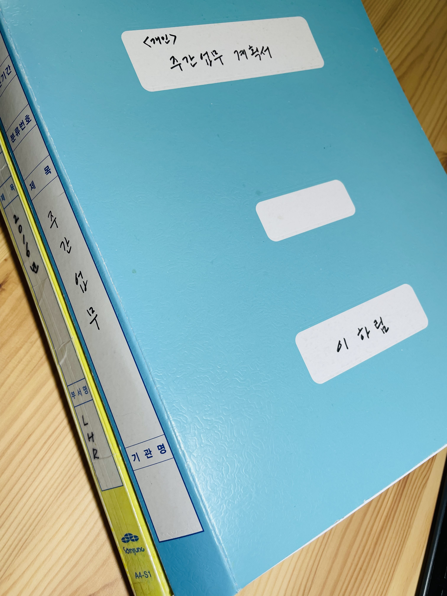

# 🌟 About Me

## 대학 졸업 후 Timeline

 (1) (1).png>)

몰두해서 일하고 최선을 다해 인사 업무를 했었습니다.

1년의 고민 끝에, 다시 신입으로 돌아가기로 결심했습니다.&#x20;

6개월 간 매일 14시간 이상 공부하고, 프로젝트에 몰입하면서 보냈습니다.

신입의 열정과 사회생활을 하며 배운 책임감으로 새로운 곳에서 모든 것을 쏟아내고자 합니다.

## 잘 하는 것과 좋아하는 것

* **잘 하는 것 : 기록**

.png>).png>)

사회생활을 시작하면서 꾸준히 업무 일지를 작성했습니다. 누락된 부분이나 놓친 지시는 없는지 체크했고 유사한 업무를 할 때 참고할 수 있는 자료가 됐습니다.

또, 선배들에게 질문한 내용은 반드시 개인 노트에 메모해뒀고 필요할 때마다 노트를 찾아보며 업무를 처리했습니다.

이렇게 꾸준히 기록하는 습관은 입사 후, 빠른 적응에 도움을 주고 회사에 도움이 되는 인재가 되는 데에 큰 힘이 될 것입니다.

* **좋아하는 것 : 보는 모든 것**

영화, Youtube, 책, 수목원 구경, 사람 구경 등 보는 것들은 모두 좋아합니다.

서서 보는 것보다 앉아서 보는 것들이 더 많아, 시간 가는 줄 모르고 앉아 있는 경우도 종종 있습니다.

## 그동안 배우고 적용해 본 기술

* JAVA - JDK 1.8
* ORACLE XE 11g
* Spring Framework 5
* Spring boot 2.5.4
* MyBatis 3
* ajax, Jquery, JavaScript, HTML5, CSS3

## 관심 기술

* Docker, AWS, Kotlin

## 경험해본 프로젝트

아래는 그동안 경험했던 프로젝트입니다. 전 프로젝트 기획,설계, 구현까지 100% 참석했으며, 프로젝트 페이지에 상세히 기술했습니다.

(최신순으로 작성)&#x20;

* **급여 전문 인사 관리 프로그램** 'HERO' 프로젝트


[Broken link](broken-reference)


* **1인 가구 부분 청소 서비스 프로그램** '맡겨줘 홈즈'


[Broken link](broken-reference)


* **(toy project) 여행 메이트 매칭 서비스** '혼또니'


[Broken link](broken-reference)


