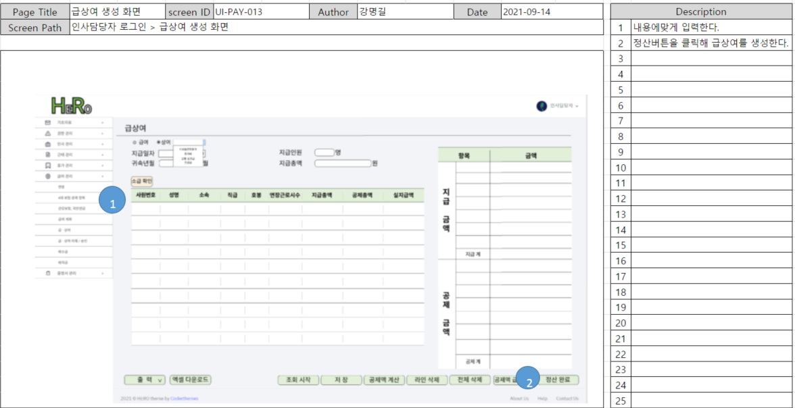

# 급상여 관리-생성

## 1. 단위 업무 흐름도

.png>)

인사 담당자로 로그인 후, '급여 관리' 메뉴에서 '급상여 관리'로 들어간 뒤 생성이 가능한 흐름입니다.

생성 시에는 사원 정보, 연봉 정보, 4대보험 정보를 가져와 산출합니다.

정산이 완료되면 급상여 정보로 저장되며 프로세스가 종료됩니다.

## 2. 데이터베이스 모델링

급상여 생성에는 거의 대부분의 엔터티가 연관이 있어, 부분을 쪼개 설명하겠습니다.

직접적으로 관련 있는 엔터티는 총 17개입니다.

#### 1) 호봉 및 발령

.png>)

* 임직원 계정 : 직원의 개인 정보를 담은 엔터티
* 발령 : 직원의 발령 사항을 담은 엔터티. 입사, 퇴사 등 발령에 따라 급상여 지급 금액이 차이가 있을 수 있기에 필요
* 직급별 호봉 : 회사 전체 호봉별 금액에 영향을 주는 엔터티
* 직급별 호봉 변경 이력 : 회사 전체 적용되는 호봉별 금액 혹은 호봉 구조의 변경 이력을 담은 엔터티
* 직원별 호봉 : 직원의 현재 호봉을 담은 엔터티. 호봉번호로 '직급별 호봉'에서 호봉금액을 조회해 올 수 있음
* 임직원 직급별 호봉변경 이력 : 직원의 호봉 변경 이력을 담고 있는 엔터티

#### 2) 급여 기준, 4대보험 , 소득세 등 지급과 공제 관련

.png>)

* 급여 기준 : 해당 회사에서 정책 상 호봉 외 지급하는 급여 정보 (ex. 차량유지비, 통신비, 문화비 등)
* 직원별 월 지급 목록 :  직원별 '급여 기준'에 해당하는 항목을 저장한 엔터티 (ex. 1번 직원 통신비 지급)
* 보험요율 : 매년 변경되는 4대보험 요율 엔터티. 회사의 업종코드, 인원수에 따라 별도로 적용
* 직원별 건강보험 국민연금 공제금액 : 보험요율 엔터티에서 식별번호를 받아와 직원별로 보험금액을 저장하는 엔터티. 건강보험, 국민연금의 보수월액, 적용일자, 보험료 등을 저장
* 직원별 세부 공제 내역 : 직원별로 공제했던 내역을 저장하는 엔터티. 귀속년월, 지급일자, 공제항목(소득세, 주민세, 4대보험 등), 공제금액 등을 저장
* 급상여 지급 목록 : 유도 속성으로 급상여가 지급되면 직원별로 전체 내역이 저장되는 엔터티. 지급 총액과 공제총액, 이체금액 등이 저장

#### 3) 세부 지급내역, 사업주 공제내역, 은행 정보&#x20;

.png>)

* 직원별 세부 지급내역 : 직원별로 지급했던 내역을 저장하는 엔터티. 귀속년월, 지급일자, 지급항목(기본급, 통신비, 팀장 수당 등 월 지급항목 등등) 등을 저장
* 사업주 공제 내역 : 임직원과 대부분 동일한 금액을 공제하나 고용보험과 산재보험은 사업주 부담분이 별도로 있기에 별도 저장. 이후 법인세, 원천세 등 재무 관련 프로그램과 확장할 수 있도록 별도 저장
* 은행 : 금융감독원에서 발표하는 은행코드와 은행명 중 일부를 저장하는 엔터티. 신규 은행이 등록 시 해당 엔터티에 저장
* 직원 계좌번호 : 급상여 생성 이후 이체될 은행 계좌번호를 저장
* 직원 계좌번호 변경 이력 : 직원별 급여계좌 변경 이력을 저장

## 3. 화면 정의서

급상여 생성 화면에서 생성을 진행하게 되면 왼쪽 테이블에서 전체 직원의 지급총액, 공제총액, 이체금액이 표기됩니다.

세부 내역을 조회하고 싶은 직원의 row를 선택하면 오른쪽 table에서 지급 내역 및 공제 내역이 조회되고 수정도 가능합니다.

## 4. 시퀀스 다이어그램

.png>)

최초에 인사 담당자가 급 상여 생성을 하기 전, 해당 기간 동일 항목으로 생성된 데이터가 있는지 DB에서 확인합니다.

생성 내역이 없을 경우, view에서 생성 여부를 확인 받아 인사 담당자가 '생성' 버튼을 클릭하면 service에서 필요한 데이터를 불러온 후, 산출합니다.

산출 후, 결과 값을 List\<SalaryAndBonusDTO>에 담아 view에 보여주는 로직입니다. &#x20;

## 5. 구현 화면 및 코드

**해결 과제**&#x20;

**: 급상여 생성 시, 발령 사항 등을 반영해 지급 금액, 공제 금액을 산출하고 특이 사항이 있을 경우 수정이 가능한가?**

 (1).png>)

급상여 생성 프로세스는 굉장히 복잡하게 느껴졌기 때문에 필요한 로직, 코드, click event 등을 모두 수기로 작성해보며 고민했습니다.&#x20;

필요하면 그림을 그리고, **** 필요한 내용을 다 적어보며 빠진 부분이 없는지 체크했습니다.

그렇게 고민을 거듭한 뒤, 아래와 같은 화면과 코드를 구현했습니다.

 (1).png>)

* **Service**

.png>)

\-발령에 따라, 일수 연산 진행 → 급여를 일할 계산 후 지급 금액에 반영했습니다.

ex) 발령 중, 무급 휴직은 휴직 시작월과 휴직 중일 때 지급 금액에 차이가 있습니다.

9월 6일부터 무급 휴직을 시작하고 11월 5일에 복직할 직원이 있다고 가정했습니다.

9월 급여 : 9월 1일 \~ 9월 5일까지는 재직했기에 급여 지급

10월 급여 : 무급 기간이기에 0원 입니다.

11월 : 11월 5일에 복직했기에, 11월 6일 \~ 11월 30일까지 급여 지급

* **Service**

 (1).png>)

\-개인별 세부 내역 수정은 급여 지급일 이후이거나, 결재권자의 결재가 완료됐을 때는 수정이 불가능하게 설정했습니다.

구분자(변수명 editable)를 통해 수정 가능 여부를 확인할 수 있게 설정했습니다.

* **View**

 (1).png>)

\-service에서 담아온 구분자를 바탕으로 view의 차이 발생&#x20;

수정이 불가능할 경우 input 태그는 readonly

수정 가능할 경우, '변경 완료'와 '정산 종료' 버튼 클릭 가능합니다.
