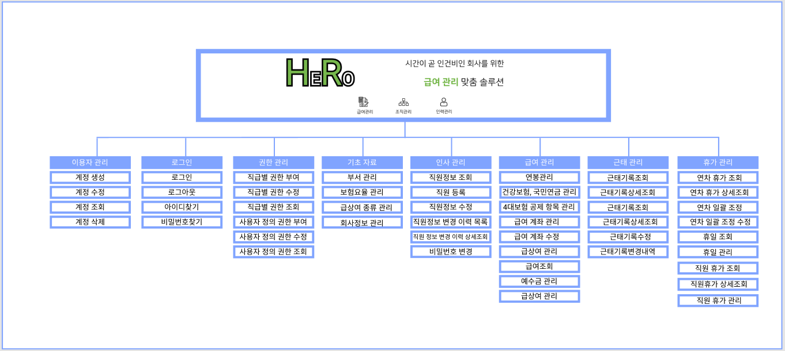

# step2 설계

## 설계 과정

1. 데이터베이스 설계
2. 기획 및 화면 설계
3. 프로그램 설계

## 1. 데이터베이스 설계

#### 먼저, 논리 데이터 모델(ERD)를 작성했습니다.

* 사용 tool : DA#
* 표기법 : Barker 표기법

.png>)

자세한 설계 과정과 내용은 다음 페이지에 작성했습니다.


[undefined.md](../../../1/cleanhome/step2/undefined.md)


## 2. 기획 및 화면 설계

운영 정책,  IA(Information Architecture)와 메뉴 구조도,화면 정의서를 작성했습니다.

역시 자세한 내용은 아래의 페이지에서 확인하실 수 있습니다.


[undefined-1.md](undefined-1.md)


## 3. 프로그램 설계

프로그램 설계를 통해, 전체 프로그램 목록을 확정하고 package명, method명, url 등을 결정했습니다.

.png>)

이에 맞게 초기 세팅 담당자가 설정을 하면 구현 작업에 들어갔습니다.

프로그램 설계 과정 및 결과물은 아래 페이지에서 확인하실 수 있습니다.


[undefined-2.md](undefined-2.md)


