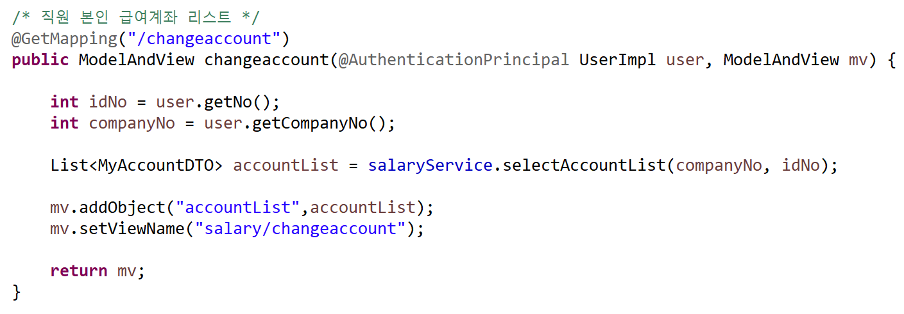
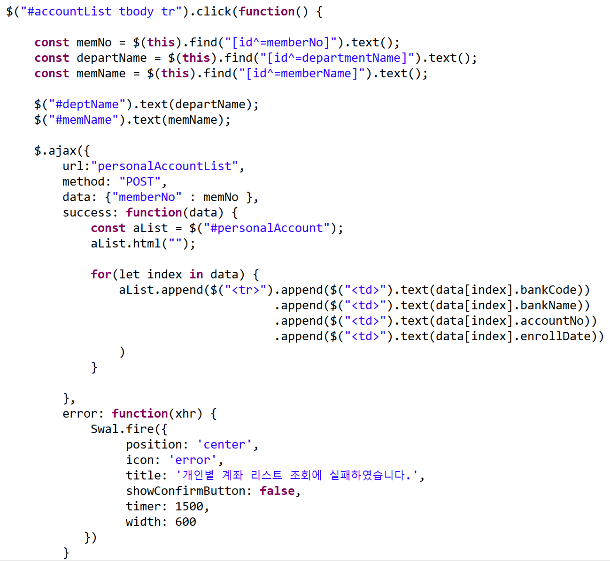

# 이하림 구현 화면 및 코드

## 구현 화면 및 코드

### 1) 연봉 관리

#### 해결 과제 : 특정한 시기 혹은 대상의 연봉이 정상적으로 조회 되며, 필요한 경우 수정이 가능한가?

 (1).png>)

* **SQL**

 (1).png>)

\- 날짜 검색 : 검색어를 입력한 시기에 맞는 호봉과 월 지급액을 검색해야 하기 때문에 '변경 이력' 테이블에서 검색했습니다. 또, 해당 일자에 유효한 값을 조회하기 위해 Subquery로 Max 값을 조회해 왔습니다.

* **Service**

 (1).png>)

\-호봉 외 월 지급 항목이 있는 경우, 월 지급 금액을 합산 후 연산 처리 → 호봉 변경 일자와 월 지급 금액 변경 일자 중, 최신의 일자를 '설정 시작일'로 처리했습니다.

#### 연봉 수정

 (1) (1).png>)

* **Service**

 (1).png>)

\-월 지급 항목은 두 가지로 구분 가능합니다. 더 이상 지급하지 않는 경우와, 새롭게 특정 항목을 지급하는 경우입니다.

따라서, 더 이상 지급하지 않는 경우 사용자가 '0'원을 입력하면 기존 항목을 DB에서 update 처리했고, 새롭게 특정 항목을 지급하는 경우 insert 처리했습니다.

### 2) 4대 보험 공제 항목 관리

**해결 과제 : 현재 재직자의 공제 항목이 정상적으로 보이며, 수정 시 반영이 되는가?**

 (1).png>)

* **Service**

 (1).png>)

\-parameter로 전달 받은 값(=변경된 값)과 기존 DB에 저장된 값을 비교해, 변동 사항이 있다면 update해줬습니다.&#x20;

&#x20;

### 3) 건강보험, 국민연금 관리

#### 해결 과제&#x20;

#### : 현재 재직자의 보수월액을 입력 혹은 수정할 수 있으며, 수정 시 납부 금액을 자동 계산하는가? 감면 대상자는 감면 적용이 가능한가?

 (1).png>)

* View - HTML

 (1).png>)

\-자동 계산은 view에서 처리했으며, DB에서 값을 조회해야 할 경우 ajax를 활용해 연산 후 표기했습니다.

### 4) 급여 계좌 관리

**해결 과제**

&#x20;**: 일반 직원으로 로그인 한 경우, 본인이 설정한 급여 계좌 이력을 보여주고 추가할 수 있는가? 인사 담당자는 개인별 급여 계좌 이력을 조회할 수 있는가?**

**일반 직원**으로 로그인 한 경우

.png>)

* **Controller**

\-session에 저장된 회사 번호와 계정 번호를 parameter에 담아 전송 → 로그인 한 계정의 급여 계좌 조회 결과값을 view에서 보여줍니다.

**인사 담당자**로 로그인한 경우

 (1).png>)

* View

\-조회할 직원 선택 시(화면 상 2번), ajax로 해당 직원 정보 전달 → 조회한 결과값을 append 하여 보여줍니다.

### 5) 급상여 관리

**해결 과제**&#x20;

**: 급상여 생성 시, 발령 사항 등을 반영해 지급 금액, 공제 금액을 산출하고 특이 사항이 있을 경우 수정이 가능한가?**

 (1).png>)

* **Service**

.png>)

\-발령에 따라, 일수 연산 진행 → 급여를 일할 계산 후 지급 금액에 반영했습니다.

ex) 발령 중, 무급 휴직은 휴직 시작월과 휴직 중일 때 지급 금액에 차이가 있습니다.

9월 6일부터 무급 휴직을 시작하고 11월 5일에 복직할 직원이 있다고 가정했습니다.

9월 급여 : 9월 1일 \~ 9월 5일까지는 재직했기에 급여 지급

10월 급여 : 무급 기간이기에 0원 입니다.

11월 : 11월 5일에 복직했기에, 11월 6일 \~ 11월 30일까지 급여 지급

* **Service**

 (1).png>)

\-개인별 세부 내역 수정은 급여 지급일 이후이거나, 결재권자의 결재가 완료됐을 때는 수정이 불가능하게 설정했습니다.

구분자(변수명 editable)를 통해 수정 가능 여부를 확인할 수 있게 설정했습니다.

* **View**

 (1).png>)

\-service에서 담아온 구분자를 바탕으로 view의 차이 발생&#x20;

수정이 불가능할 경우 input 태그는 readonly

수정 가능할 경우, '변경 완료'와 '정산 종료' 버튼 클릭 가능

### 6) 급상여 이체 승인

**해결 과제**&#x20;

**: 이체 승인(=결재) 시, 직원의 급상여 금액과 계좌 정보가 일치하는가? 이전 결재 내역도 정상적으로 조회 되는가?**

 (1).png>)

* **view**

 (1).png>)

\-결재 상태에 따라 승인 버튼의 활성화 or 비활성화했습니다.

\-선택한 시기의 급상여 이체 정보는 ajax로 처리했습니다.

**일반 직원의 본인 급여 내역 조회**

.png>)

* SQL

 (1).png>)

\-대표이사가 결재 완료된 것 (CONFIRM\_YN = 'Y')을 조회해오기 때문에 결재 전의 미확정 급여는 확인할 수 없습니다.

### 7) 공제 예수금 조회

**해결 과제 : 조회하려는 기간의 공제 금액이 조회 되는가?**

 (1).png>)

* **Service**

.png>)

\-지급 일자별, 월별 공제 총액 확인 가능하도록, 검색 결과에 맞게 합산 처리했습니다.
