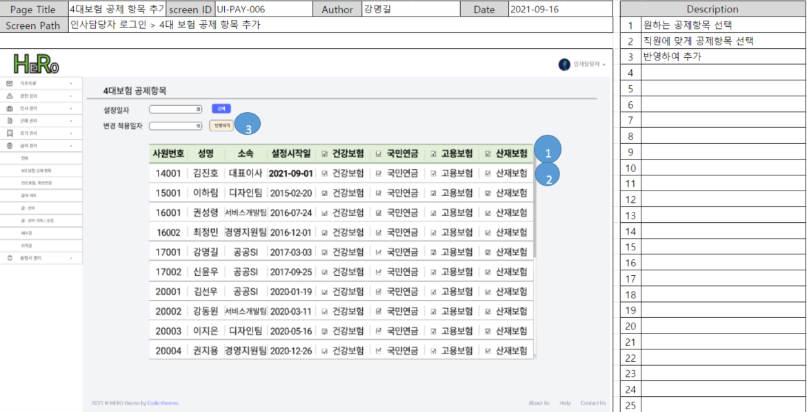

# 4대 보험 공제 항목 관리

## 1. 단위 업무 흐름도

.png>)

인사담당자가 로그인 한 후, '급여 관리' 메뉴를 선택 후 '4대보험 공제 항목'을 선택하면 CRUD가 가능하도록 구성하려고 합니다.&#x20;

## 2. 데이터베이스 모델링

.png>)

4대보험 공제항목을 수정, 변경하는 데에는 총 3개의 엔터티가 필요했습니다.

* 임직원 계정 : 직원의 사원번호, 입사일 등 정보를 담은 엔터티
* 4대보험공제항목 : 직원별로 건강보험, 국민연금, 고용보험, 산재보험 공제 여부를 저장할 엔터티
* 4대보험 공제항목 변경이력 : 변경사항이 발생할 때, 직원별 변경 이력을 저장할 엔터티

## 3. 화면 정의서

table 방식으로 직원 정보가 출력 되고, 4대보험 중 공제항목은 checkbox에서 checked 표기가 됩니다.

만약 변경사항이 있다면 checked에 변경을 주고 변경 적용일자를 작성해 '변경' 버튼을 클릭하는 방식입니다.

## 4. 시퀀스 다이어그램

.png>)

최초 공제 항목 화면에 진입하면, DB에서 현재 기준 공제 항목을 조회해 view에서 보여줍니다.

인사 담당자가 checkbox의 상태 및 적용일자를 설정해 submit 하게 되면 변경된 내역이 DB에 반영되고,

redirect 되는 로직으로 구성했습니다.

## 5. 구현 화면 및 코드

**해결 과제 : 현재 재직자의 공제 항목이 정상적으로 보이며, 수정 시 반영이 되는가?**

 (1).png>)

처음 화면 정의서를 작성했을 땐 설정 시작일이 table 상단에 있었습니다.

하지만 아래 사진처럼 구현 과정에서 '사람 행동 순서'를 작성하며 고민을 해보다 보니 수정이 필요했습니다.

 (1).png>)

텍스트 내용

*   사람 행동 순서&#x20;

    &#x20;1\. checkbox 든 뭐든 바꾼다&#x20;

    &#x20;2\. 적용 일자를 쓴다 (1,2 변경 가능)&#x20;

    &#x20;3\. 다른 사람 모두 바꾸면

    &#x20;4\. '적용' 버튼을 누름

사용자가 어떤 순서로 행동해도 문제가 생기지 않게끔 행동 순서를 적어보고, 다양한 경우의 수를 조합해보았습니다.

또, 직원별로 변동 내역 시작일이 다를 수 있기 때문에 최종적으로 설정 시작일을 table의 td로 삽입했습니다.&#x20;

그리고 변경된 내역만 service로 넘기는 것이 아닌, 화면에 출력한 전체 내역을 전달해 service에서 변경 내역을 확인 후 DB에 저장하도록 설정했습니다.&#x20;

화면에 보이는 table 데이터 전부를 다시 controller로 넘 날의 업무일지는 아래의 링크에서 보실 수 있습니다.



* **Service**

 (1).png>)

\-parameter로 전달 받은 값(=변경된 값)과 기존 DB에 저장된 값을 비교해, 변동 사항이 있다면 update해줬습니다.&#x20;
