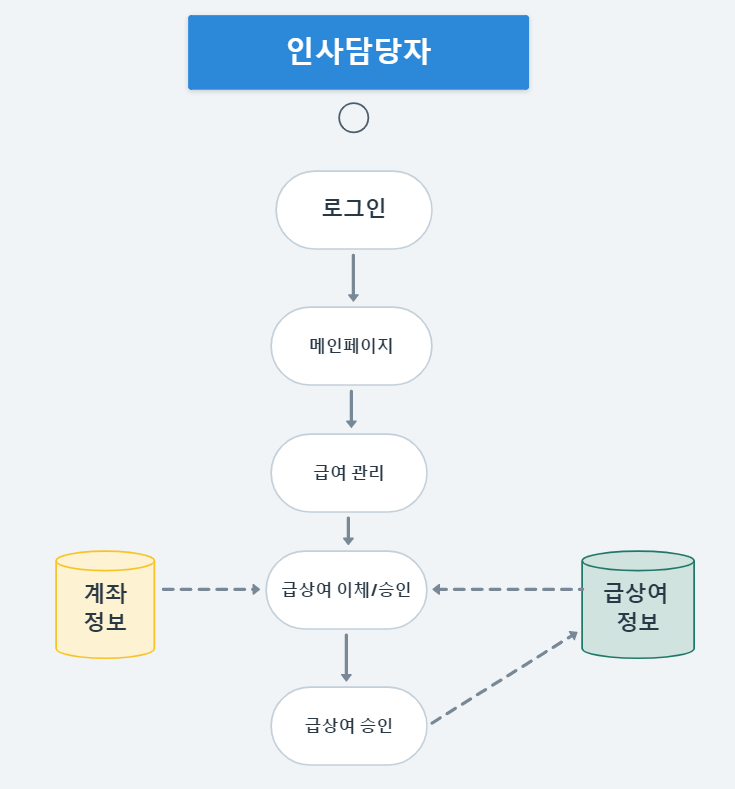
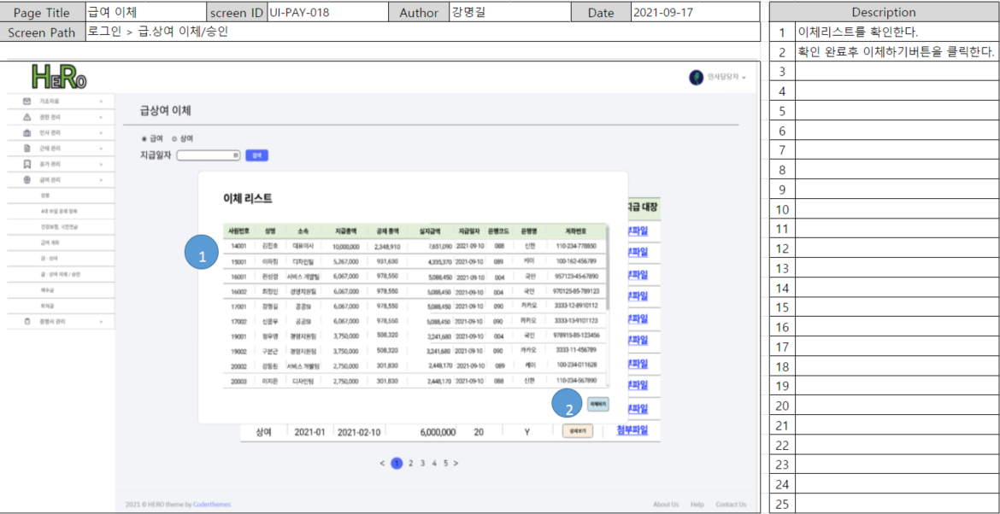

# 급상여 이체 승인 및 조회

본 기능은 급상여 관리 중 **급상여 생성이 된 항목에 한 해 처리**할 수 있습니다.

급상여 생성에 관한 내용은 아래의 페이지를 참고 부탁 드립니다.


[undefined-1.md](undefined-1.md)


## 1. 단위 업무 흐름도

* **결재권을 가진 인사 담당자의 급상여 이체/승인**

**해당 페이지 접근 권한이 있는 인사 담당자**로 로그인 후, '급여 관리' 메뉴에서 '급상여 이체/승인' 항목을 선택하면 급상여 정보와 직원의 계좌정보를 불러옵니다.

만약 승인, 즉 결재 전인 경우에만 승인 가능하며 승인 처리 시 DB에 update 됩니다.

* **일반 직원의 본인 급여 조회**

.png>)

**결재가 완료된 내역에 한 해**, 일반 직원은 본인의 급상여 명세서를 조회할 수 있습니다.

## 2. 데이터베이스 모델링

급상여 생성과 관련된 항목은 제외 후 설명하겠습니다.&#x20;

.png>)

필요한 엔터티는 총 3개입니다.

* 급상여 지급 목록 : 유도 속성. 직원별 특정 귀속년월과 지급일자에 지급총액, 공제총액, 이체금액 등을 저장한 데이터
* 직원 계좌번호 : 승인 당시 유효한 직원의 계좌번호
* 직원 계좌번호 변경 이력 : 이미 승인한 급상여 지급 목록을 조회할 때, 당시의 계좌번호를 조회할 용도

## 3. 화면 정의서

* **결재권을 가진 인사 담당자의 급상여 이체/승인**

'급상여 이체승인' 메뉴에 접속하면 table에 전체 지급 항목들이 최신순으로 조회됩니다.

그 중 결재가 필요한 항목 혹은 세부 내역을 보기 위한 항목을 선택하면 modal창이 뜹니다.

modal 창에는 개인별 급상여 지급총액, 공제총액, 이체금액, 이체될 은행명과 계좌번호가 뜨며 하단에 '결재' 버튼을 클릭하면 결재가 완료됩니다.

'결재'버튼은 결재가 필요한 항목일 때만 뜨며, 이미 결재 완료된 경우 modal 창 종료만 가능합니다.

* **일반 직원의 본인 급여 조회**

.png>)

결재권자가 결재를 완료하면, 일반 직원은 본인 계정으로 로그인 후 급상여 명세서를 확인할 수 있습니다.

## 4. 시퀀스 다이어그램

* **결재권을 가진 인사 담당자의 급상여 이체/승인**

.png>)

결재권자가 '급상여 이체/승인' 메뉴를 클릭하면, DB에서 최신순으로 전체 지급 항목들이 조회됩니다.

미승인, 즉 결재가 필요한 내역에 대해 결재권자가 승인을 클릭하게 되면 DB에 update 됩니다.

update 결과가 return되고 해당 페이지는 redirect 됩니다.&#x20;

* **일반 직원의 본인 급여 조회**

.png>)

일반 직원이 본인 계정으로 로그인 후, '급여 내역' 메뉴에 진입하면 DB에서 해당 사번으로 생성된 급상여 내

## 5. 구현 화면 및 코드

**해결 과제 **

**: 이체 승인(=결재) 시, 직원의 급상여 금액과 계좌 정보가 일치하는가? 이전 결재 내역도 정상적으로 조회 되는가?**

 (1).png>)

* **view**

 (1).png>)

\-결재 상태에 따라 승인 버튼의 활성화 or 비활성화했습니다.

\-선택한 시기의 급상여 이체 정보는 ajax로 처리했습니다.

**일반 직원의 본인 급여 내역 조회**

.png>)

* SQL

 (1).png>)

\-대표이사가 결재 완료된 것 (CONFIRM\_YN = 'Y')을 조회해오기 때문에 결재 전의 미확정 급여는 확인할 수 없습니다.
