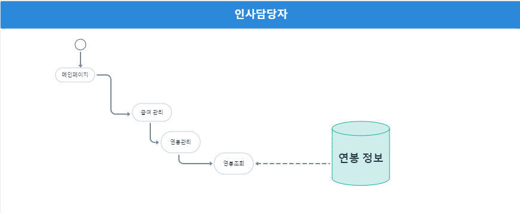

# 연봉 관리

## 1. 단위 업무 흐름도

**연봉 조회**는 인사담당자로 로그인 후, 메인 페이지에서 '급여 관리'를 선택 → 연봉 관리를 선택하면 DB에서 연봉 정보를 조회해 화면에서 보여주는 방식입니다.

**연봉 수정**의 경우, 조회 한 데이터에서 수정 시 다시 연봉 정보 DB에 update 되는 방식으로 구현하고자 합니다.

## 2. 데이터베이스 모델링

.png>)

해당 기능을 구현하기 위해 필요한 엔터티는 크게 7개입니다.

* 임직원 계정 : 직원 개인정보를 담고 있는 엔터티 (사번, 입사일, 성명 등 활용)
* 직급별 호봉 : 해당 회사가 '현재' 설정한 직급별, 호봉별 금액을 담은 엔터티
* 직급별 호봉 변경 이력 : 해당 회사가 과거에 설정했던 직급별, 호봉별 금액을 저장하는 엔터티
* 직원별 호봉 :  직원별 호봉 정보를 저장한 엔터티
* 임직원 직급별 호봉 변경 이력 : 직원별 호봉 변경 이력을 저장한 엔터티
* 급여 기준 : 해당 회사에서 정책 상 호봉 외 지급하는 급여 정보 (ex. 차량유지비, 통신비, 문화비 등)
* 직원별 월 지급 목록 :  직원별 '급여 기준'에 해당하는 항목을 저장한 엔터티 (ex. 1번 직원 통신비 지급)

위 엔터티에서 필요한 정보를 CRUD 할 수 있게 설계했습니다.

## 3. 화면 정의서

인사 담당자로 로그인 후, '급여 관리' 메뉴에서 '연봉 관리'를 클릭하면 현재 유효한 연봉을 조회해옵니다. '월 지급항목' 버튼 클릭 시 매월 정기 지급분이 modal 창으로 떠, 조회할 수 있습니다.

수정 버튼을 누르면 수정이 가능하고, 수정 완료를 선택하면 설정한 적용일자에 변경됩니다.

## 4. 시퀀스 다이어그램

* 연봉 조회

.png>)

연봉 조회 화면에 진입하면 DB에서 연봉 리스트(List\<MngSalaryDTO>)를 조회한 뒤, view에서 보여줍니다.

인사 담당자가 조회된 내역 중, 특정 직원의 월 지급 금액 조회 버튼을 클릭하면, 해당 직원의 월 지급 금액(List\<MemberMonthlyPayDTO>)를 return 합니다.

* 연봉 수정

.png>)

조회한 연봉에서 수정할 항목을 적용해, DB에 보내면 결과가 저장됩니다. 적용 후, 다시 연봉 내역(List\<MemberMonthlyPayDTO>)이 return 됩니다.

## 5. 구현 화면 및 코드

#### 해결 과제 : 특정한 시기 혹은 대상의 연봉이 정상적으로 조회 되며, 필요한 경우 수정이 가능한가?

 (1).png>)

### 1) 연봉 조회

* <mark style="background-color:blue;">**SQL**</mark>

 (1).png>)

\- 날짜 검색 : 검색어를 입력한 시기에 맞는 호봉과 월 지급액을 검색해야 하기 때문에 '변경 이력' 테이블에서 검색했습니다. 또, 해당 일자에 유효한 값을 조회하기 위해 Subquery로 Max 값을 조회해 왔습니다.

* <mark style="background-color:blue;">**Service**</mark>

.png>)

직면했던 문제&#x20;

: 직원 정보와 직급별 호봉 금액은 join하여 가져 왔으나(노란 음영), 월 지급 금액(파란 음영)은 일치하는 정보가 있는 경우에만 join, 일치하는 정보가 없을 경우엔 null인 쿼리문을 짜고 싶었습니다.

한 번에 해결할 방법을 찾기 위해 excel로 원하는 결과 값을 적어보고 고민했습니다.&#x20;

하지만 minus, union과 left outer join 불가로 아래처럼 select 구문을 두 번 호출하는 것으로 해결했습니다.

.png>)

위 방식을 구현하던 날의 고민을 살펴보실 수 있는 업무일지는 아래의 링크에서 확인 가능하십니다.



 (1).png>)

\-호봉 외 월 지급 항목이 있는 경우, 월 지급 금액을 합산 후 연산 처리 → 호봉 변경 일자와 월 지급 금액 변경 일자 중, 최신의 일자를 '설정 시작일'로 처리했습니다.

### 2) 연봉 수정

 (1) (1).png>)

* **Service**

 (1).png>)

\-월 지급 항목은 두 가지로 구분 가능합니다. 더 이상 지급하지 않는 경우와, 새롭게 특정 항목을 지급하는 경우입니다.

따라서, 더 이상 지급하지 않는 경우 사용자가 '0'원을 입력하면 기존 항목을 DB에서 update 처리했고, 새롭게 특정 항목을 지급하는 경우 insert 처리했습니다.

