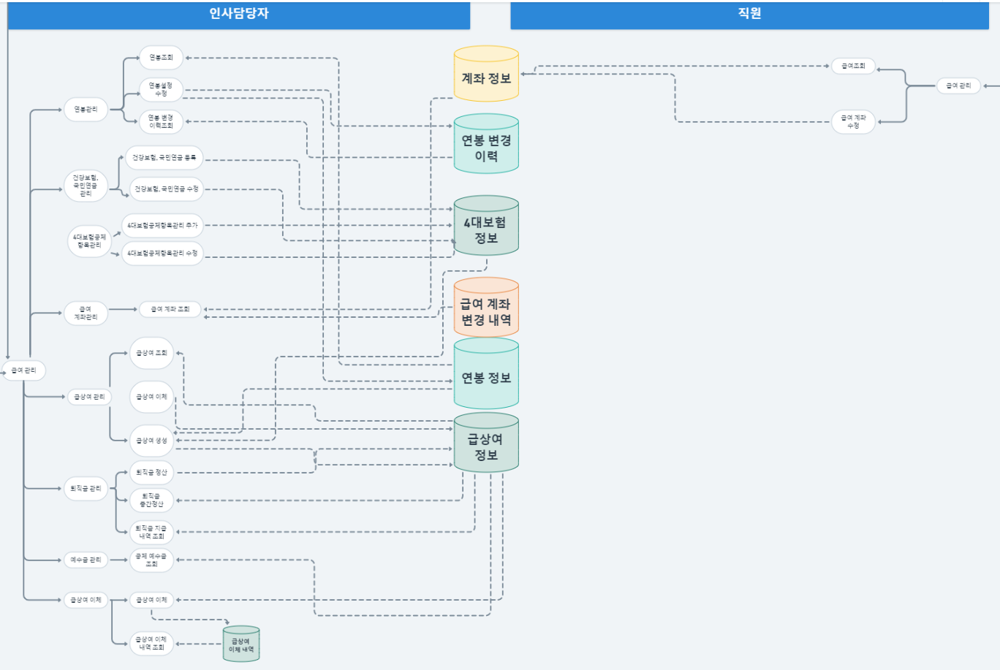

# step1 기획

## 1. 제안 요청

프로젝트를 시작하며 **시장 조사, 유사 프로그램 분석, 주요 기능, 기대 효과** 등을 사전에 조사/정리 했습니다.&#x20;

참고할 서비스가 있는지, 있다면 진행하려는 프로젝트와 유사점은 어떤 것이고 차이점은 무엇인지 알 수 있었습니다. 또, 이번 프로젝트가 유의미한 경험이 될 수 있는지 등을 미리 확인해볼 수 있었습니다.

&#x20;&#x20;

.png>)

.png>)

.png>)

## 2. 업무 분석 및 요건 정의

급여 전문 인사 관리 프로그램을 만들면서, 반드시 알아야 하는 기본 개념과 법령, 산출 방식 등을 조사했습니다. 또 인사 담당자들이 실무에서 사용할 수 있는 프로그램을 만들기 위해  요구사항 명세, 프로토타이핑 등도 제작했습니다.

.png>)

국가법령정보센터, 4대보험 공단 등 공식 홈페이지 등에서 정확한 정보를 얻어 작성했습니다. 간혹 용어에 대한 이해가 필요한 경우 노무사 블로그 등을 활용해 이해하고 정보를 모았습니다.

.png>)

각자의 담당 파트를 어떤 흐름으로 이어갈 것이며, DB는 어떤 테이블이 필요할 것인지 예측하기 위해 전체 업무 흐름도와 단위 업무 흐름도를 작성했습니다.

전체 업무 흐름도와 단위 업무 흐름도는 'whimsical'이라는 협업 툴을 활용해, 의견을 나누며 함께 작업했습니다.

 (1).png>)

이렇게 프로그램에 대한 전반적인 이해, 구조 등을 협의한 뒤 설계 작업에 들어갔습니다.
