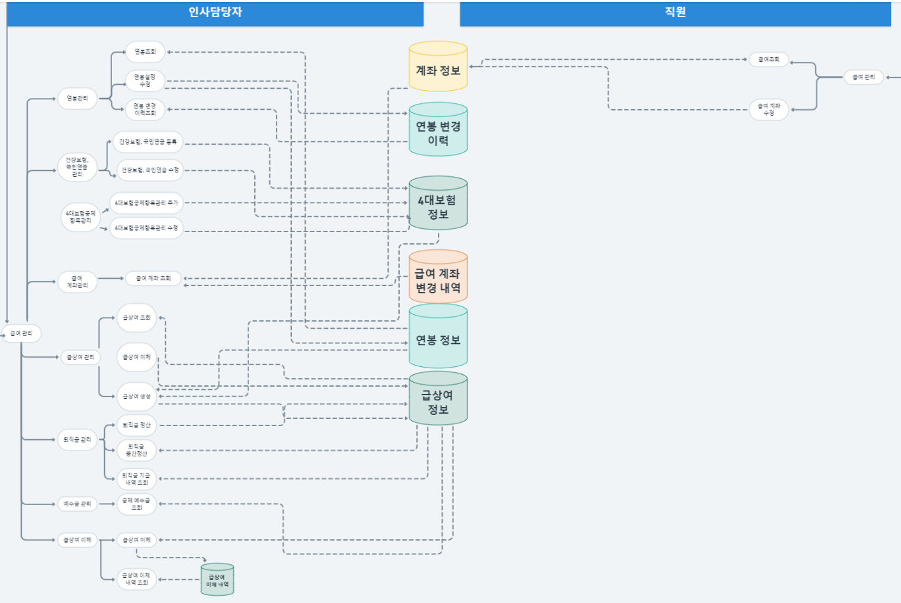

# 기획부터 구현까지

'HERO' 프로젝트 **모든 산출물** - notion 주소 : [https://url.kr/2d1eyj](https://url.kr/2d1eyj)

## 1. 업무 분석, 요건 정의, 기획

담당 파트를 어떤 흐름으로 이어갈 것이며, DB는 어떤 테이블이 필요할 것인지 예측하기 위해

전체 업무 흐름도와 단위 업무 흐름도를 작성했습니다.

.png>)

#### 작성된 걸 바탕으로 논리 데이터 모델(ERD)를 작성했습니다.

.png>)

* 사용 tool : DA#
* 표기법 : Barker 표기법

#### \*엔터티 설명 (오른쪽 위부터 차례로)

1\) **'업체 기본 정보' 엔터티 **1개에는 여러 개의 '임직원 계정'이 포함됩니다. (ex.한 회사에 여러 명의 직원 有)&#x20;

&#x20;   \-> 1:다 관계

2\) **'업체 기본 정보' 엔터티** 1개는 여러 개의 '직급별 호봉'을 가질 수 있습니다.&#x20;

&#x20;   \-> 역시 1:다 관계

3\) **'직급별 호봉'**은 회사번호(FK)와 '직급별 호봉'을 식별자로 가집니다.

4\)** '직급별 호봉'**은 회사의 정책에 따라 언제든 변경될 수 있고, 변경 이력은 꾸준히 쌓이는 데이터이므로 **'직급별 호봉 변경 이력' 엔터티**와는 1:다 관계입니다. 직급별 호봉 변경 이력 엔터티는 '변경 번호'를 구분자로 갖습니다.

5\) '직급별 호봉'과 '임직원 계정'에서 데이터를 가져와 '직원별 호봉' 엔터티를 구성합니다. 직원의 호봉은 계속 변하는 값이기 때문에 '임직원 직급별 호봉 변경 이력' 엔터티가 필요합니다. 역시 1:다 관계이며 변경할 때마다 이 엔터티에 insert 됩니다.

## 2. 구현

prototyping을 만들었지만 view부터 DB까지 프로세스가 복잡하거나 방안이 떠오르지 않은 부분이 있었습니다. 이를 해결하기 위해 문제를 잘게 쪼개고 고민해가면서 코드를 작성했습니다.

아래는 문제 해결 방안을 고민한 흔적들입니다.

### 1) 4대 보험 공제 항목 수정 - view 로직 해결

.png>)

텍스트 내용

*   사람 행동 순서&#x20;

    &#x20;1\. checkbox 든 뭐든 바꾼다&#x20;

    &#x20;2\. 적용 일자를 쓴다 (1,2 변경 가능)&#x20;

    &#x20;3\. 다른 사람 모두 바꾸면

    &#x20;4\. '적용' 버튼을 누름

사용자가 어떤 순서로 행동해도 문제가 생기지 않게끔 행동 순서를 적어보고, 다양한 경우의 수를 조합해보았습니다.

* 최종 적용 화면

.png>)

### 2) 직급별 호봉 금액과 월 지급 금액 조회 쿼리문 처리

.png>)

직면한 문제 : 직원 정보와 직급별 호봉 금액은 join하여 가져 왔으나(노란 음영), 월 지급 금액(파란 음영)은 일치하는 정보가 있는 경우에만 join, 일치하는 정보가 없을 경우엔 null

&#x20;\- union 적용 불가, left outer join 불가 → 트랜젝션 2번 처리하는 것으로 해결&#x20;

쿼리문에서 한 번에 해결할 방법을 찾기 위해 excel로 원하는 결과 값을 적어보고 고민했습니다.&#x20;

### 3) 급상여 생성 시, 발령 따른 월 지급액 산출 프로세스

.png>)

* 최종 구현 코드

.png>)

.png>)

급상여 생성 프로세스는 굉장히 복잡하게 느껴졌기 때문에 필요한 로직, 코드, click event 등을 모두 수기로 작성해보며 고민했습니다.&#x20;

필요하면 그림을 그리고, if-else if를 작성해보며 빠진 부분이 없는지 체크했습니다.

## 2-2. 구현 코드

### 1) 연봉 관리

#### 해결 과제 : 특정한 시기 혹은 대상의 연봉이 정상적으로 조회 되며, 필요한 경우 수정이 가능한가?

.png>)

* SQL

.png>)

\- 날짜 검색 : 검색어를 입력한 시기에 맞는 호봉과 월 지급액을 검색해야 하기 때문에 '변경 이력' 테이블에서 검색했습니다. 또, 해당 일자에 유효한 값을 조회하기 위해 Subquery로 Max 값을 조회해 왔습니다.

#### 연봉 수정

.png>)

* Service

.png>)

\-월 지급 항목은 두 가지로 구분 가능합니다. 더 이상 지급하지 않는 경우와, 새롭게 특정 항목을 지급하는 경우입니다.

따라서, 더 이상 지급하지 않는 경우 사용자가 '0'원을 입력하면 기존 항목을 DB에서 update 처리했고, 새롭게 특정 항목을 지급하는 경우 insert 처리했습니다.

### 2) 건강보험, 국민연금 관리

#### 해결 과제&#x20;

#### : 현재 재직자의 보수월액을 입력 혹은 수정할 수 있으며, 수정 시 납부 금액을 자동 계산하는가? 감면 대상자는 감면 적용이 가능한가?

.png>)

* View - HTML

.png>)

\-자동 계산은 view에서 처리했으며, DB에서 값을 조회해야 할 경우 ajax를 활용해 연산 후 표기했습니다.

## 3. 프로젝트 소감

&#x20;성장하는 즐거움을 느낀 프로젝트였습니다. 배울 땐 와 닿지 않고, 사용법도 막막했던 부분들이 특정 문제를 해결하는 핵심이 될 때 성장했음을 느꼈습니다.

&#x20; 미숙했던 ajax를 좀 더 자주 사용해 제 것으로 만들었고, 그동안 써 볼 기회가 없었던 문법들을 찾아보며 복습과 적용을 겸할 수 있었습니다. 이를 통해 문제를 해결했을 땐 뿌듯함도 느낄 수 있었습니다.

지속적으로 즐거움을 맛보기 위해 꾸준히 노력들을 쌓고, 이를 성장의 동력으로 만들겠습니다.
